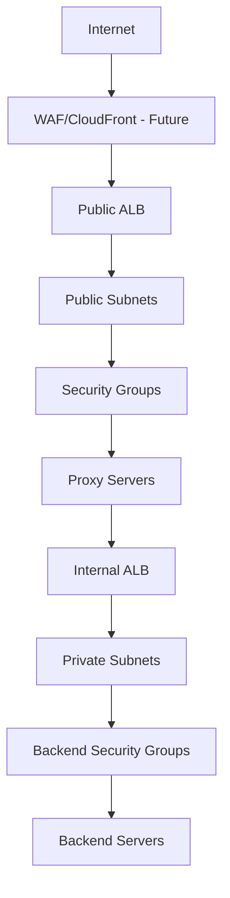

# 🏗️ Terraform Lab 3: Multi-Tier AWS Infrastructure with Modular Design

A comprehensive Infrastructure as Code (IaC) project demonstrating enterprise-level Terraform practices with modular architecture, load balancing, and multi-availability zone deployment.

[](https://terraform.io)
[](https://aws.amazon.com)
[](LICENSE)

## 🎯 Architecture Overview

This project implements a complete multi-tier architecture on AWS with enterprise-grade practices:

```
┌──────────────────────────────────  ──────────────────────────────────────┐
│                           VPC (10.0.0.0/16)                              │
│  ┌─────────────────────────────┐  ┌────────────────────────────────────┐ │
│  │        us-east-1a           │  │           us-east-1b               │ │
│  │  ┌───────────────────────┐  │  │  ┌───────────────────────────────┐ │ │
│  │  │ Public Subnet         │  │  │  │ Public Subnet                 │ │ │
│  │  │ (10.0.0.0/24)         │  │  │  │ (10.0.2.0/24)                 │ │ │
│  │  │  ┌─────────────────┐  │  │  │  │  ┌─────────────────────────┐  │ │ │
│  │  │  │ Proxy Server    │  │  │  │  │  │ Proxy Server            │  │ │ │
│  │  │  │ (Nginx Reverse) │  │  │  │  │  │ (Nginx Reverse)         │  │ │ │
│  │  │  └─────────────────┘  │  │  │  │  └─────────────────────────┘  │ │ │
│  │  └───────────────────────┘  │  │  └───────────────────────────────┘ │ │
│  │  ┌───────────────────────┐  │  │  ┌───────────────────────────────┐ │ │
│  │  │ Private Subnet        │  │  │  │ Private Subnet                │ │ │
│  │  │ (10.0.1.0/24)         │  │  │  │ (10.0.3.0/24)                 │ │ │
│  │  │  ┌─────────────────┐  │  │  │  │  ┌─────────────────────────┐  │ │ │
│  │  │  │  Backend Server │  │  │  │  │  | Backend Server          |  │ │ │
│  │  │  │ (Nginx Web)     │  │  │  │  │  │ (Nginx Web)             │  │ │ │
│  │  │  └─────────────────┘  │  │  │  │  └─────────────────────────┘  │ │ │
│  │  └───────────────────────┘  │  │  └───────────────────────────────┘ │ │
│  └─────────────────────────────┘  └────────────────────────────────────┘ │
└─────────────────────────────────  ───────────────────────────────────────┘

🌐 Internet → 🔄 Public ALB → 🖥️ Proxy Servers → 🔄 Internal ALB → 🗄️ Backend Servers
```

## ✨ Key Features

- **🏛️ Multi-Tier Architecture**: Separate public proxy and private backend tiers
- **🚀 High Availability**: Resources distributed across 2 Availability Zones
- **⚖️ Load Balancing**: Public and internal Application Load Balancers
- **🧩 Modular Design**: Reusable Terraform modules for maximum scalability
- **🔒 Enterprise Security**: Security groups with least privilege principles
- **🤖 Full Automation**: Remote provisioners + user-data for zero-touch deployment
- **📊 State Management**: S3 backend with DynamoDB locking for team collaboration
- **🔍 Observability**: Health checks, logging, and monitoring built-in

## 📋 Lab Requirements Fulfilled

- ✅ **Requirement 1**: Dev workspace implementation with proper isolation
- ✅ **Requirement 2**: Custom Terraform modules (100% custom, no public modules)
- ✅ **Requirement 3**: Remote S3 state storage with versioning
- ✅ **Requirement 4**: Remote provisioners + local-exec for automated IP collection
- ✅ **Requirement 5**: Data sources for dynamic AMI selection
- ✅ **Requirement 6**: Public ALB (internet-facing) + Internal ALB (private networking)
- ✅ **Requirement 7**: Complete GitHub repository with comprehensive documentation

## 📁 Project Structure

```
terraform-aws-infrastructure/
├── 📄 main.tf                     # Root module orchestrating all components
├── 📄 variables.tf                # Comprehensive variable definitions
├── 📄 terraform.tfvars            # Environment-specific variable values
├── 📄 outputs.tf                  # Structured output definitions
├── 📄 provider.tf                 # AWS provider and S3 backend configuration
├── 📄 all-ips.txt                 # Auto-generated IP address inventory
├── 📁 modules/                    # Enterprise-grade custom modules
│   ├── 🌐 vpc/                    # VPC and core networking foundation
│   ├── 🔗 subnet/                 # Multi-AZ subnet management
│   ├── 🌍 igw/                    # Internet Gateway configuration
│   ├── 🔀 nat/                    # NAT Gateways with Elastic IP management
│   ├── 🛣️ route_table/            # Advanced routing and associations
│   ├── 🛡️ security_group/         # Granular security group management
│   ├── 🖥️ ec2/                    # EC2 instances with automated configuration
│   │   ├── 📜 proxy-userdata.sh   # Nginx reverse proxy automation
│   │   └── 📜 backend-userdata.sh # Backend server automation
│   └── ⚖️ alb/                    # Application Load Balancer orchestration
├── 📁 Initialization/             # Infrastructure bootstrap components
│   ├── 📄 main.tf                 # S3 bucket and DynamoDB table setup
│   ├── 📄 variables.tf            # Bootstrap variable definitions
│   └── 📄 outputs.tf              # Bootstrap outputs
└── 📚 README.md                   # This comprehensive documentation
```

## 🚀 Quick Start Guide

### Prerequisites

- **AWS CLI** configured with appropriate IAM permissions
- **Terraform** >= 1.0 installed and in PATH
- **SSH key pair** for secure EC2 access
- **Git** for version control

### Step 1: Repository Setup

```bash
# Clone the repository
git clone https://github.com/SNOWxZERO/Terraform-Final-Project.git
cd Terraform-Final-Project

# Verify Terraform installation
terraform version
```

### Step 2: Bootstrap Infrastructure

```bash
# Set up S3 bucket for remote state storage (run once)
cd Initialization
terraform init
terraform plan
terraform apply

# Note the bucket name and DynamoDB table for backend configuration
cd ..
```

### Step 3: Configure Access Credentials

**Option A: Environment Variables (Recommended for CI/CD)**

```bash
export AWS_ACCESS_KEY_ID="your-access-key"
export AWS_SECRET_ACCESS_KEY="your-secret-access-key"
export AWS_DEFAULT_REGION="us-east-1"
```

**Option B: AWS Profile Configuration**

```bash
aws configure --profile dev
# Enter your credentials when prompted
```

### Step 4: SSH Key Configuration

```bash
# Generate SSH key pair (if not exists)
ssh-keygen -t rsa -b 2048 -f ~/.ssh/mykey -N ""

# Update terraform.tfvars with your paths
cat >> terraform.tfvars << EOF
public_key_path = "~/.ssh/mykey.pub"
private_key_path = "~/.ssh/mykey"
EOF
```

### Step 5: Deploy Infrastructure

```bash
# Create and select development workspace
terraform workspace new dev
terraform workspace select dev

# Initialize Terraform with backend
terraform init

# Validate configuration syntax
terraform validate

# Review deployment plan
terraform plan

# Deploy infrastructure (takes ~10-15 minutes)
terraform apply

# Confirm with 'yes' when prompted
```

## 🧪 Testing & Verification

### Infrastructure Health Checks

```bash
# Verify all outputs
terraform output

# Test public load balancer functionality
curl $(terraform output -raw Testing_Urls | jq -r '.public_alb_url')

# Test load balancing (should show different servers)
for i in {1..5}; do 
  echo "Request $i:"
  curl -s $(terraform output -raw Testing_Urls | jq -r '.public_alb_url') | grep -o "Server: [^<]*"
  echo "---"
done

# Check health endpoints
curl $(terraform output -raw Testing_Urls | jq -r '.public_alb_url')/health
```

### SSH Access Verification

```bash
# Direct proxy server access
ssh -i ~/.ssh/mykey ec2-user@$(terraform output -raw SSH_Commands | jq -r '.proxy1' | cut -d'@' -f2)

# Backend server access via bastion (proxy)
ssh -i ~/.ssh/mykey -o ProxyJump=ec2-user@<proxy-public-ip> ec2-user@<backend-private-ip>

# View auto-generated IP inventory
cat all-ips.txt
```

### Application Flow Testing

```bash
# Test complete proxy chain
# Internet → Public ALB → Proxy → Internal ALB → Backend
curl -v $(terraform output -raw Testing_Urls | jq -r '.public_alb_url')

# Monitor real-time logs (from proxy server)
ssh -i ~/.ssh/mykey ec2-user@<proxy-ip>
sudo tail -f /var/log/nginx/access.log
```

## 🏗️ Module Documentation

### Core Infrastructure Modules

#### VPC Module (`modules/vpc/`)

```hcl
# Creates enterprise-grade VPC foundation
- VPC with custom CIDR (10.0.0.0/16)
- DNS hostname and resolution support
- Proper tagging for resource management
```

#### Subnet Module (`modules/subnet/`)

```hcl
# Multi-AZ subnet architecture
- Public subnets (2) with auto-assign public IP
- Private subnets (2) for secure backend placement
- Cross-AZ distribution for high availability
```

#### Security Group Module (`modules/security_group/`)

```hcl
# Comprehensive security management
- Least privilege access controls
- Support for CIDR and security group references
- Separate groups for each tier (public, private, ALB)
```

### Application Modules

#### EC2 Module (`modules/ec2/`)

```hcl
# Automated instance deployment
- Dynamic AMI selection via data sources
- Remote provisioners for software installation
- User-data scripts for zero-touch configuration
- Support for proxy and backend server types
```

#### ALB Module (`modules/alb/`)

```hcl
# Advanced load balancing
- Internet-facing and internal load balancers
- Health check configuration with custom endpoints
- Target group management with automatic registration
- SSL/HTTPS ready (certificates can be added)
```

## 🔧 Advanced Configuration

### Environment Customization

All infrastructure is data-driven through `terraform.tfvars`:

```hcl
# Core Configuration
name_prefix = "MyCompany-Production"
aws_region  = "us-west-2"

# Network Configuration
vpc_cidr = "10.0.0.0/16"
subnets_config = {
  public_subnet_1a = {
    cidr_block        = "10.0.0.0/24"
    availability_zone = "us-west-2a"
    map_public_ip     = true
  }
  # ... additional subnets
}

# Instance Configuration
instances = {
  proxy1 = {
    instance_type       = "t3.small"  # Upgrade for production
    subnet_key         = "public_subnet_1a"
    security_group_keys = ["public"]
    server_type        = "proxy"
    user_data          = "proxy-userdata.sh"
  }
  # ... additional instances
}
```

### Scaling the Architecture

```hcl
# Add more instances easily
instances = {
  # Existing instances...
  proxy3 = {
    instance_type       = "t3.micro"
    subnet_key         = "public_subnet_1a"
    security_group_keys = ["public"]
    server_type        = "proxy"
    user_data          = "proxy-userdata.sh"
  }
  backend3 = {
    instance_type       = "t3.micro"
    subnet_key         = "private_subnet_1a"
    security_group_keys = ["private"]
    server_type        = "backend"
    user_data          = "backend-userdata.sh"
  }
}
```

## 💰 Cost Analysis

**Estimated Monthly Costs (us-east-1):**

| Component | Quantity | Unit Cost | Monthly Total |
|-----------|----------|-----------|---------------|
| EC2 t2.micro | 4 instances | $8.50 | ~$34 |
| Application Load Balancer | 2 ALBs | $16.20 | ~$32 |
| NAT Gateway | 2 gateways | $45.00 | ~$90 |
| Elastic IPs | 2 EIPs | $3.65 | ~$7 |
| Data Transfer | Estimated | $10.00 | ~$10 |

**💡 Total Estimated: ~$173/month**

*Costs may vary based on usage patterns and data transfer*

## 🔒 Security Architecture

### Defense in Depth Strategy



### Security Group Rules

| Group | Direction | Port | Protocol | Source/Destination | Purpose |
|-------|-----------|------|----------|-------------------|---------|
| **public** | Inbound | 22 | TCP | 0.0.0.0/0 | SSH management |
| **public** | Inbound | 80 | TCP | ALB Security Group | HTTP from ALB |
| **private** | Inbound | 22 | TCP | Public Subnets | SSH via bastion |
| **private** | Inbound | 80 | TCP | Internal ALB SG | HTTP from Internal ALB |
| **alb-public** | Inbound | 80 | TCP | 0.0.0.0/0 | Public web traffic |
| **alb-internal** | Inbound | 80 | TCP | Proxy Security Group | Internal communication |

## 🛠️ Operational Procedures

### Routine Maintenance

```bash
# Update infrastructure
terraform plan
terraform apply

# Scale instances
# Edit terraform.tfvars, then:
terraform plan
terraform apply

# Backup state
aws s3 cp s3://your-bucket/dev/terraform.tfstate ./backup/
```

### Disaster Recovery

```bash
# Emergency rebuild
terraform plan -target=module.ec2
terraform apply -target=module.ec2

# State recovery
terraform import aws_instance.example i-1234567890abcdef0
```

### Monitoring & Debugging

```bash
# Enable detailed Terraform logging
export TF_LOG=DEBUG
export TF_LOG_PATH=./terraform.log

# Check resource state
terraform state list
terraform state show aws_instance.proxy1

# Validate modules individually
terraform validate
terraform fmt -recursive
```

## 🧹 Cleanup Procedures

### Complete Infrastructure Removal

```bash
# Destroy all resources (in correct order)
terraform destroy

# Confirm destruction
terraform state list  # Should be empty

# Clean up workspace
terraform workspace select default
terraform workspace delete dev

# Optional: Remove S3 state bucket
cd Initialization
terraform destroy
```

### Partial Cleanup (Module-specific)

```bash
# Remove only EC2 instances
terraform destroy -target=module.ec2

# Remove only load balancers
terraform destroy -target=module.alb
```

## 🔍 Troubleshooting Guide

### Common Issues & Solutions

#### 1. **Credential/Authentication Errors**

```bash
# Problem: "No valid credential sources found"
# Solution:
export AWS_ACCESS_KEY_ID="your-key"
export AWS_SECRET_ACCESS_KEY="your-secret"

# Verify credentials
aws sts get-caller-identity
```

#### 2. **SSH Access Issues**

```bash
# Problem: Permission denied (publickey)
# Solution:
chmod 600 ~/.ssh/mykey
chmod 644 ~/.ssh/mykey.pub

# Test SSH connectivity
ssh -i ~/.ssh/mykey -o ConnectTimeout=5 ec2-user@<public-ip>
```

#### 3. **State Lock Issues**

```bash
# Problem: "Error acquiring the state lock"
# Solution:
terraform force-unlock <lock-id>

# Prevention: Always use proper workflow
terraform plan && terraform apply
```

#### 4. **Module Loading Issues**

```bash
# Problem: "Module not found"
# Solution:
terraform init -upgrade
terraform get -update
```

#### 5. **Load Balancer Health Check Failures**

```bash
# Debug health checks
aws elbv2 describe-target-health --target-group-arn <arn>

# Check Nginx status on instances
ssh -i ~/.ssh/mykey ec2-user@<ip>
sudo systemctl status nginx
sudo journalctl -u nginx -f
```

## 📈 Performance Optimization

### Instance Right-Sizing

```hcl
# Production recommendations
instances = {
  proxy1 = {
    instance_type = "t3.small"    # Better network performance
    # ... other settings
  }
  backend1 = {
    instance_type = "t3.medium"   # More memory for applications
    # ... other settings
  }
}
```

### Load Balancer Optimization

```hcl
# Enhanced health checks
health_check = {
  enabled             = true
  healthy_threshold   = 2
  unhealthy_threshold = 3
  timeout             = 5
  interval            = 30
  path                = "/health"
  matcher             = "200"
}
```

## 🚀 Future Enhancements

### Planned Improvements

- [ ] **Auto Scaling Groups** for dynamic scaling
- [ ] **CloudWatch** monitoring and alerting
- [ ] **AWS WAF** for web application firewall
- [ ] **CloudFront** CDN integration
- [ ] **Route 53** DNS management
- [ ] **SSL/TLS certificates** via ACM
- [ ] **ECS/EKS** container orchestration
- [ ] **RDS** database tier
- [ ] **ElastiCache** caching layer
- [ ] **CI/CD pipeline** integration

### Extension Examples

```hcl
# Add Auto Scaling Group
resource "aws_autoscaling_group" "proxy_asg" {
  name                = "${var.name_prefix}-proxy-asg"
  vpc_zone_identifier = [for subnet in module.subnets.public_subnets : subnet.id]
  target_group_arns   = [module.alb.public_target_group_arn]
  health_check_type   = "ELB"
  min_size            = 2
  max_size            = 10
  desired_capacity    = 2
}
```

## 🤝 Contributing

We welcome contributions! Please follow these guidelines:

### Development Workflow

1. **Fork** the repository
2. **Create** a feature branch (`git checkout -b feature/amazing-feature`)
3. **Test** your changes thoroughly
4. **Commit** with descriptive messages
5. **Push** to your branch
6. **Create** a Pull Request

### Code Standards

- Follow HashiCorp Configuration Language (HCL) best practices
- Use consistent naming conventions
- Add comments for complex logic
- Update documentation for new features
- Test with `terraform validate` and `terraform plan`

### Testing Checklist

- [ ] `terraform validate` passes
- [ ] `terraform plan` shows expected changes
- [ ] All modules load correctly
- [ ] Security groups follow least privilege
- [ ] Documentation is updated

## 📞 Support & Community

### Getting Help

- **Issues**: Report bugs via GitHub Issues
- **Discussions**: Use GitHub Discussions for questions
- **Documentation**: Check this README and module docs
- **AWS Documentation**: [Terraform AWS Provider](https://registry.terraform.io/providers/hashicorp/aws/latest/docs)

### Community Resources

- [HashiCorp Learn](https://learn.hashicorp.com/terraform)
- [AWS Architecture Center](https://aws.amazon.com/architecture/)
- [Terraform Best Practices](https://www.terraform-best-practices.com/)

## 📄 License

This project is licensed under the MIT License - see the [LICENSE](LICENSE) file for details.

**Educational Use**: This project is designed for learning purposes as part of ITI DevOps training.

## 👨‍💻 Author

**Muhammad Gad**  
DevOps Engineer | ITI Student | Cloud Enthusiast

- 🌐 **GitHub**: [@SNOWxZERO](https://github.com/SNOWxZERO)
- 💼 **LinkedIn**: [Muhammad Gad](https://linkedin.com/in/muhammad-gad)
- 📧 **Email**: <muhammad.gad@example.com>
- 🎓 **Institution**: Information Technology Institute (ITI)
- 📚 **Track**: DevOps Engineering

## 🙏 Acknowledgments

- **ITI DevOps Team** for comprehensive training and guidance
- **HashiCorp** for creating Terraform and excellent documentation
- **AWS** for providing robust cloud infrastructure services
- **Open Source Community** for inspiration and best practices

---

## 📊 Project Stats


---

**🚀 Infrastructure as Code | Built with ❤️ using Terraform and AWS**

*"Infrastructure that scales, code that lasts, architecture that inspires."*

---

> **💡 Pro Tip**: Star ⭐ this repository if you found it helpful, and feel free to fork it for your own infrastructure projects!

---

Last Updated: September 2025 | Version: 2.0.0 | Terraform: 1.0+ | AWS Provider: 5.0+
