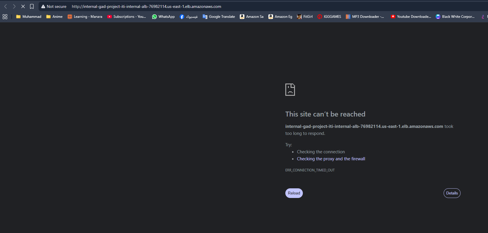
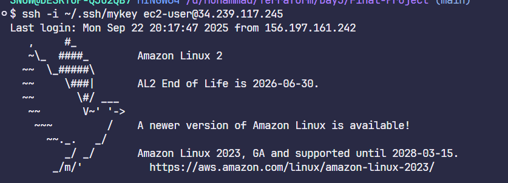
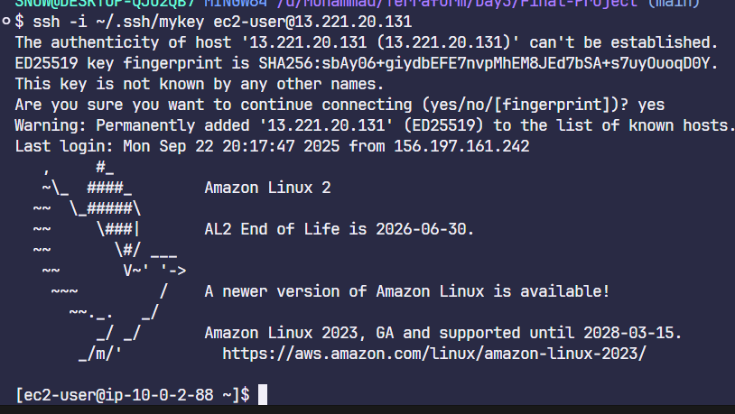
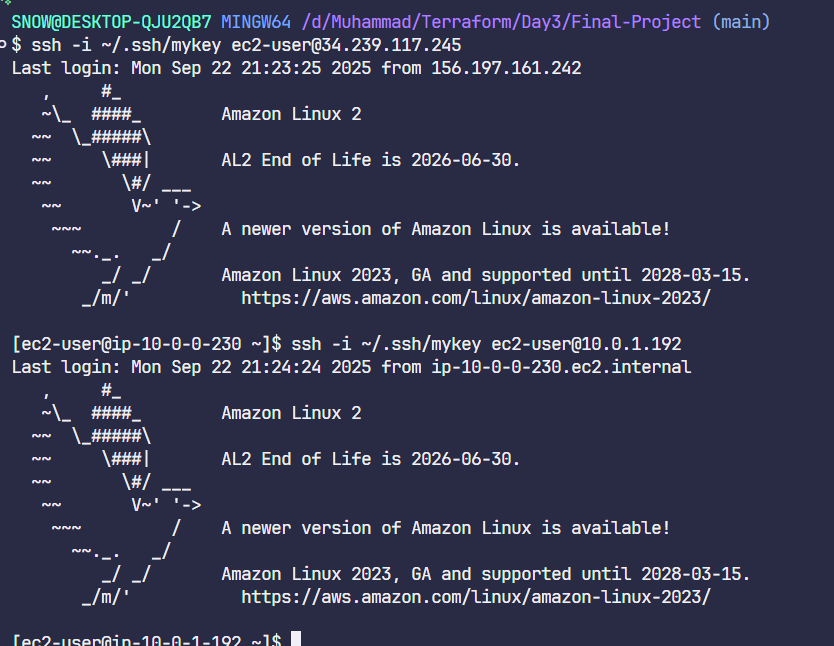
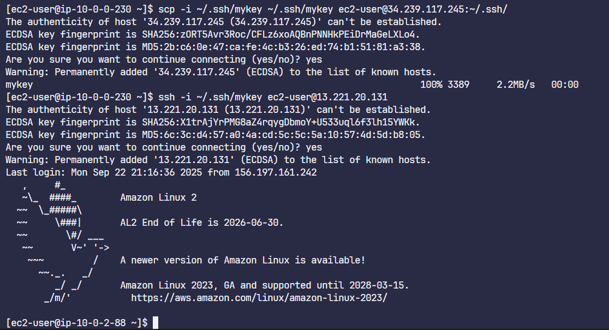
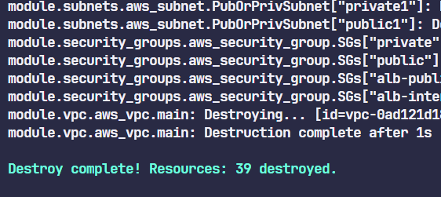

# Terraform Project Deployment

## 1. Creating the S3 Bucket for tfstate

---

## 2. Initializing the Main Project

---

## 3. Changing Workspace

---

## 4. Running `terraform apply`

  

---

## 5. Accessing the Public ALB DNS

  

---

## 6. Accessing the Internal ALB DNS

---

## 6. SSH Public instances

## 7. SSH Private instances
i forgot to add the key in the public instance so i coppied it through scp :D
and no i connect to private instance through the public instance

### first one

## second one

---

## 7. Destroying resources

---
